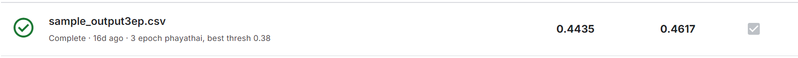

# DSDE_midterm_repo_for_TAs

1. install requirement.txt
2. download [2110446-dsde-2024-2.zip](https://www.kaggle.com/competitions/2110446-dsde-2024-2/data) to root
3. train from scratch or download weight from [google drive](https://drive.google.com/drive/folders/1bDfaffRFZTv4YtN0b1UOxatItuHPUK1F?usp=sharing)
4. if got question contact 6531347621 Athiwat in mycourseville or sumtin

# project structure

```
.
├── 2110446-dsde-2024-2.zip
├── README.md
├── Sarabun-Regular.ttf
├── phayathai-v9
│   ├── checkpoint-34530
│   │   ├── added_tokens.json
│   │   ├── config.json
│   │   ├── optimizer.pt
│   │   ├── pytorch_model.bin
│   │   ├── rng_state.pth
│   │   ├── scheduler.pt
│   │   ├── sentencepiece.bpe.model
│   │   ├── special_tokens_map.json
│   │   ├── tokenizer.json
│   │   ├── tokenizer_config.json
│   │   ├── trainer_state.json
│   │   └── training_args.bin
│   └── runs
│       └── Feb28_19-02-08_JafPC
│           ├── events.out.tfevents.1740744129.JafPC.23064.0
│           └── events.out.tfevents.1740752042.JafPC.23064.1
├── pipeline-BEST_SCORE.ipynb
├── sample_submission.csv
├── test.csv
├── test_result_output_0.4617.csv
├── train.csv
└── wandb
```

# Kaggle result


